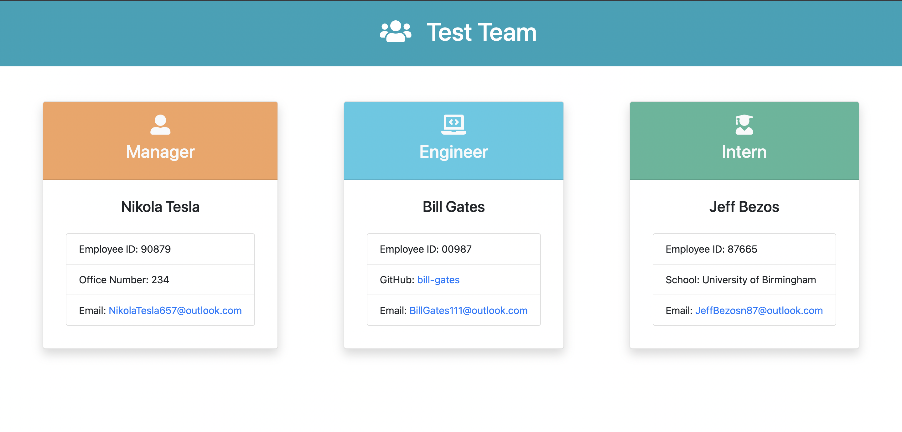
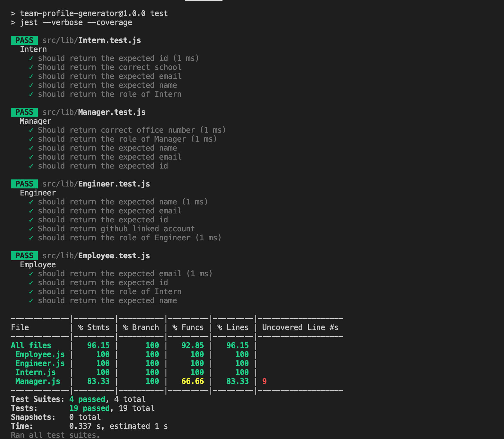

# team-profile-generator

## Table of Contents

- [Description](#description)
- [User Story](#user-story-🧍)
- [Getting Started](#getting-started-🚀)
- [Walkthrough](#walkthrough)
- [Questions](#questions)

## Description

This application uses the inquirer node.js package which allows a manager to create a team profile using the information about employees on a software engineering team, and with that information generates an HTML webpage that displays the users input data. The app presents users with a series of prompted questions regarding their team in the terminal.
Additionally to make the code maintainable the application uses Jest and Inquirer to conduct unit tests and ensure all tests pass

## User Story 🧍

```
As a manager
I want to generate a webpage that displays my team's basic info
so that I have quick access to emails and GitHub profiles

```

## Getting Started 🚀

### Installation

```
git clone git@github.com:Amalidi/team-profile-generator.git
cd team-profile-generator
```

### Once complete, run the program in the terminal:

```
npm run start
```

### To Tests

```
npm run test
```

## Walkthrough

Please click [here]() to view the demo of the application.

## Screenshot

### An Image of the project:



### An Image of the tests:



## Questions

If you have any questions about this application, please contact me by [email](mailto:A.idi12@outlook.com).
